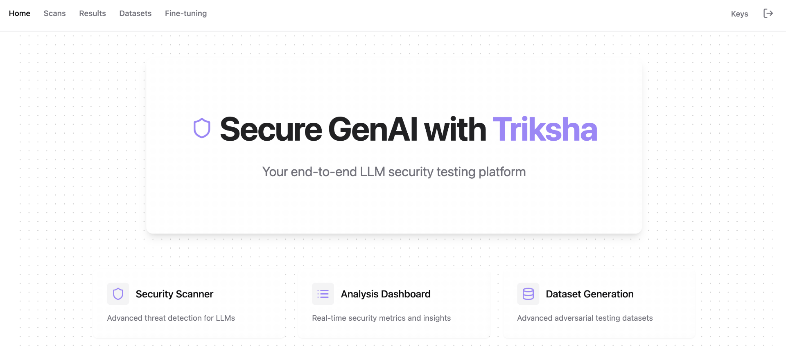

<div align="center">
  

  # Triksha - LLM Security Testing Platform

  [](https://opensource.org/licenses/MIT)
  [](https://www.typescriptlang.org/)
  [](https://reactjs.org/)
  [](https://tailwindcss.com/)
  [](https://supabase.com)
</div>

## 🚀 Overview

Triksha is a comprehensive platform for testing and enhancing the security of Large Language Models (LLMs). With advanced scanning capabilities, contextual analysis, and customizable security tests, Triksha helps ensure your AI models are robust and secure.

## ✨ Key Features

- 🔒 **LLM Security Scanning**: Comprehensive security testing for language models
- 🎯 **Contextual Analysis**: Deep dive into model behavior patterns
- 📊 **Detailed Results**: In-depth analysis and vulnerability reporting
- 🔄 **Custom Testing**: Create and manage your own security test suites
- 📈 **Fine-tuning**: Enhance model security through targeted training ( coming soon )
- 📆 **Scheduled Scans**: Automated security monitoring ( coming soon )

## 🛠️ Tech Stack

- **Frontend**: React + TypeScript + Vite
- **Styling**: Tailwind CSS + shadcn/ui
- **Backend**: Supabase
- **Containerization**: Docker
- **Authentication**: Supabase Auth

## 🚦 Getting Started

### Prerequisites

1. Create a Supabase Project:
   - Go to [Supabase](https://supabase.com) and create a new project
   - In your project dashboard, navigate to Project Settings -> API
   - Copy your Project URL and anon/public key

2. Configure API Keys:
   - OpenAI API key (Get it from [OpenAI Platform](https://platform.openai.com/api-keys))
   - Other provider keys as needed

### Installation Options

#### 🐳 Using Docker (Recommended)

```sh
# Build the Docker image
docker build -t triksha-app .

# Run the container with your environment variables
docker run -p 5173:5173 \
  -e VITE_SUPABASE_URL=your_supabase_url \
  -e VITE_SUPABASE_ANON_KEY=your_supabase_anon_key \
  triksha-app
```

#### 💻 Local Development

Requirements:
- Node.js & npm ([install with nvm](https://github.com/nvm-sh/nvm#installing-and-updating))

```sh
# Clone the repository
git clone <YOUR_GIT_URL>

# Navigate to project directory
cd <YOUR_PROJECT_NAME>

# Install dependencies
npm install

# Create .env file with your Supabase credentials
echo "VITE_SUPABASE_URL=your_supabase_url
VITE_SUPABASE_ANON_KEY=your_supabase_anon_key" > .env


# Start development server
npm run dev
```

## 📄 License

This project is licensed under the MIT License - see the [LICENSE](LICENSE) file for details.

## 🤝 Contributing

Contributions are welcome! Please feel free to submit a Pull Request.

## 📞 Support

If you have any questions or need help, please open an issue in the repository or contact our support team.

---

<div align="center">
 Developed by <a href="https://x.com/itskaranxa">Karan Arora</a>
</div>
